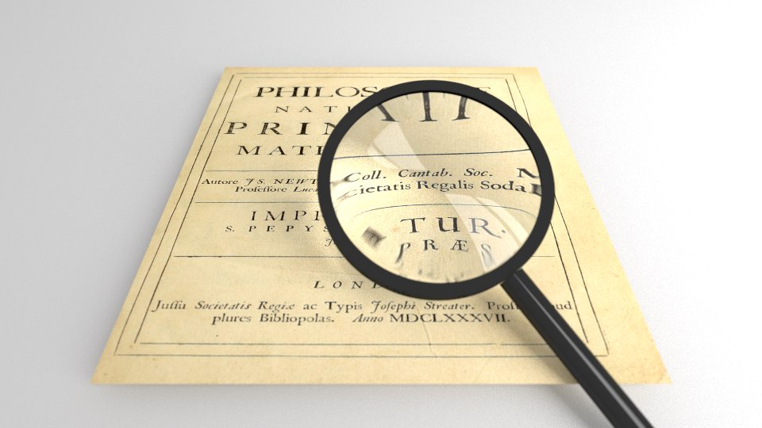
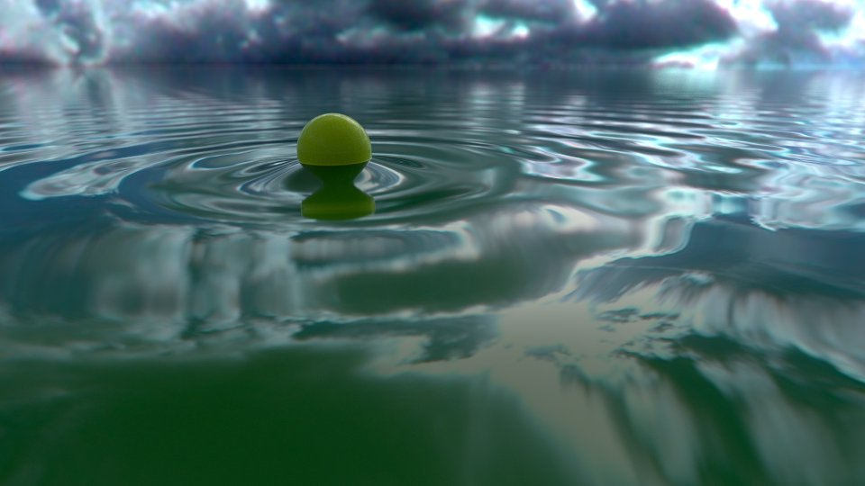
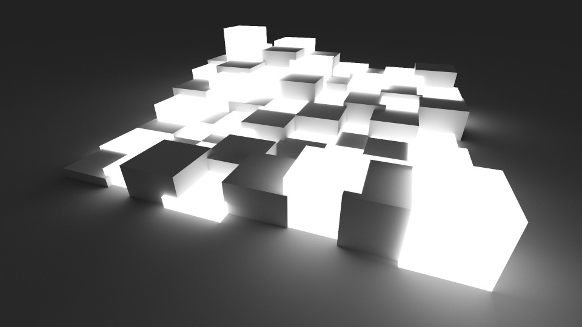
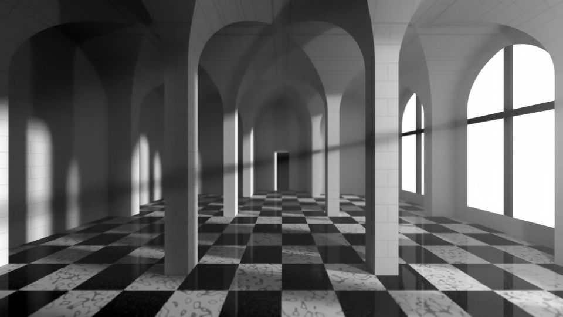
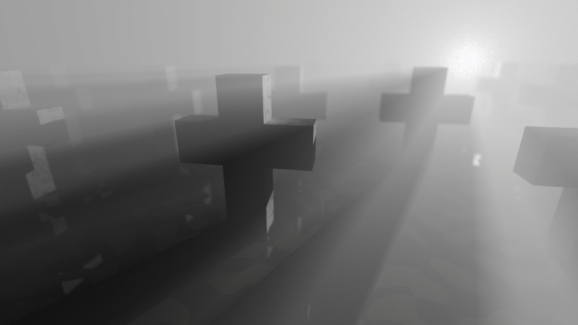

# Bruteray

Bruteray is a hobby ray tracer. It employs bi-directional path tracing, a physically accurate method that produces realistic images.

Features:

  * Indirect lighting (global illuminiation)
  * Volumetric lighting
  * Refraction
  * Depth of field

## Gallery

A few scenes rendered by bruteray:

 
 
 
 
 
 

## Cornell box

The [Cornell box](https://en.wikipedia.org/wiki/Cornell_box) is a standard scene used to compare rendering techinques.

