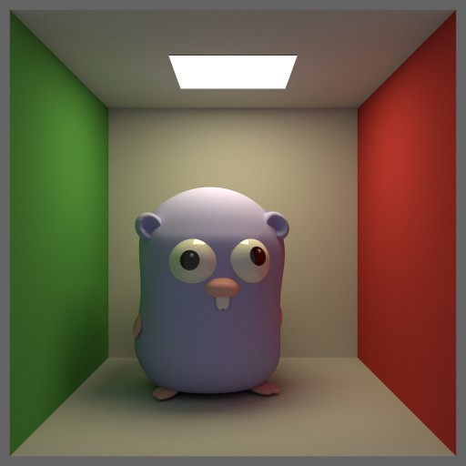

# Bruteray

 

Bruteray is physics-based ray tracer written in Go.

## Features:

  * Physically accurate lighting (incl. global illuminiation)
  * Volumetric effects
  * Reflections and refraction
  * Depth of field

## Gallery

A few scenes rendered by bruteray:

 
 
 
 
 
 

## Cornell box

The [Cornell box](https://en.wikipedia.org/wiki/Cornell_box) is a standard scene used to compare rendering techinques.

----
The Go gopher was designed by Renee French. (http://reneefrench.blogspot.com/) The gopher 3D model was made by Takuya Ueda (https://twitter.com/tenntenn). Licensed under the Creative Commons 3.0 Attributions license.
