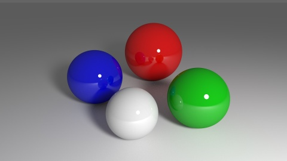
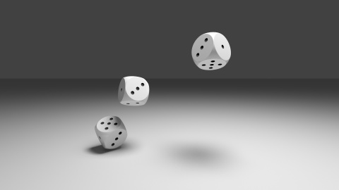
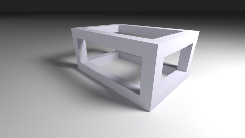

# Bruteray

Bruteray is a hobby ray tracer. It employs bi-directional path tracing, a ray tracing method that:
  - produces very realistic images
  - is relatively simple to implement
  - is rather brute force.

## Gallery

A few scenes rendered by bruteray:

