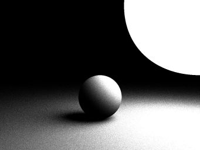
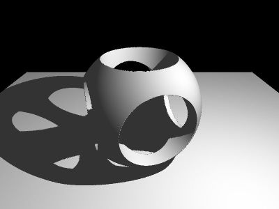

# Brute force ray tracing

## 6: Diffuse interreflection

## 5: Monte Carlo integration

Shooting many secondary rays in random directions and averaging out.

## 4: Reflection

When a ray hits a reflective surface, a reflected ray is cast. Recursion does the rest.

## 3: Shadow casting

Shadows are cast whenever the line of sight between a point and the light source intersects the scene.

## 2: Complex geometries

Shapes are simply functions of (x, y, z) that return `true` whenever a point lies inside. Simple shapes can be combined by boolean operations as well as transformed. This allows for complex geometries to be easily specified.

## 1: Depth and normal vectors

We calculate each ray's exact intersection with the scene, as well as the scene's normal vector at the intersection point. Then, we apply diffuse lighting.

## 0: basic intersection

Whenever a ray intersects an object, we color the corresponding pixel white.

