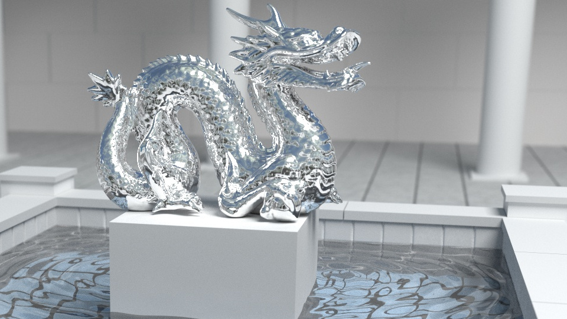
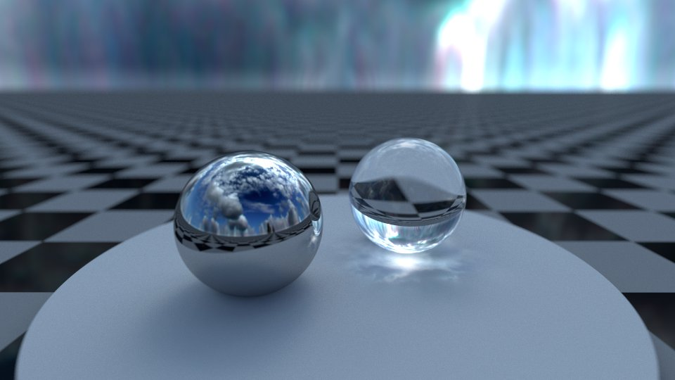

#  BruteRay  

Physics-based ray tracer in Go.

## Gallery

 
 

 
 
 
 
 
 
 
 
 
 

## Cornell box

The [Cornell box](https://en.wikipedia.org/wiki/Cornell_box) is a standard scene used to compare rendering techinques.

----
The Go gopher was designed by Renee French (http://reneefrench.blogspot.com/).
The gopher 3D model was made by Takuya Ueda (https://twitter.com/tenntenn).
The statues "Lucy", "Bunny" and "Dragon" are from the [Stanford 3D scanning repository](http://graphics.stanford.edu/data/3Dscanrep/). 
Damaliscus Korrigum skull from [artec3d.com](https://www.artec3d.com).
Other 3D modes from [free3d.com](http://free3d.com).

Licensed under the Creative Commons 3.0 Attributions license. 
