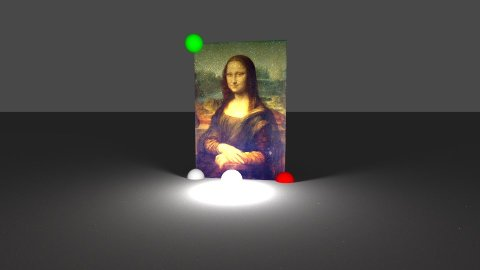

# bruteray
`import "."`

* [Overview](#pkg-overview)
* [Index](#pkg-index)
* [Subdirectories](#pkg-subdirectories)

## <a name="pkg-overview">Overview</a>
Bruteray is a ray tracer that does bi-directional path tracing.

This package is for documentation only.

### Project structure
Sub-packages:

	br        core raytracing logic and types
	mat       materials and textures
	light     various types of light sources
	shape     shapes and objects
	csg       constructive solid geometry: combine shapes
	transf    affine transformations on shapes
	raster    turns a scene into a pixel image

Additional material:

	cmd/raywatch    web interface for developing scenes
	serve           web server used by raywatch
	scenes          source files of some scenes
	tutorial        explains some ray-tracing basics

## <a name="pkg-index">Index</a>

#### <a name="pkg-files">Package files</a>
[doc.go](/src/target/doc.go) 

- - -
Generated by [godoc2md](http://godoc.org/github.com/davecheney/godoc2md)
