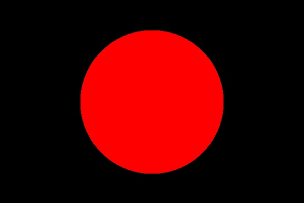
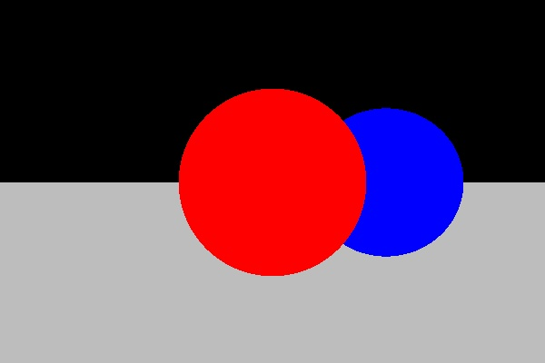
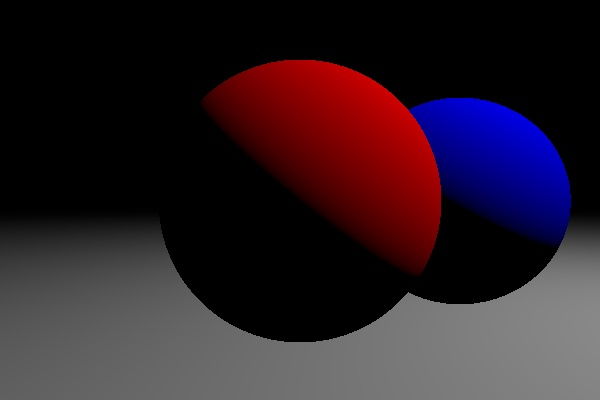
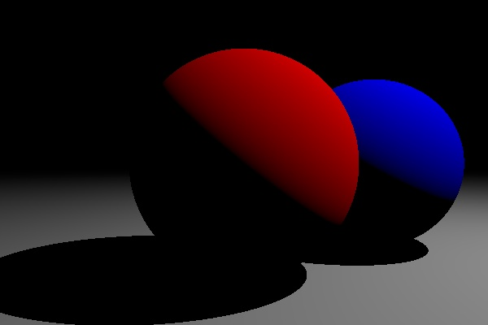
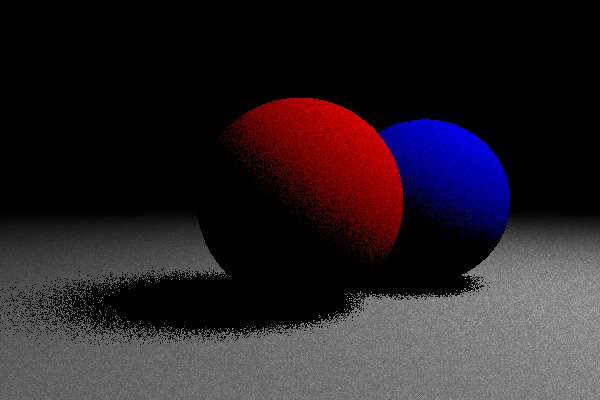
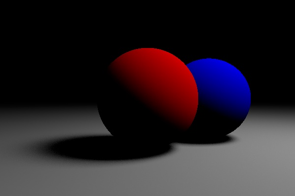
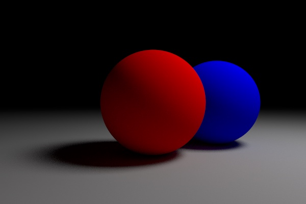
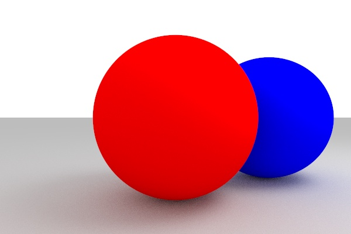

# Basics

In its most basic form, ray tracing works by:
  - casting rays from a camera, 
  - determining where they intersect the scene, 
  - and coloring the pixels accordingly.


## Intersection

A ray is a half-line. Rays are represented in parametric form: `p = s + t*d`, where:
  - `p` is a point on the ray, 
  - `s` is the position where the ray starts,
  - `d` its direction (unit vector by convention),
  - `t` the free parameter. Different `t`s (`t > 0`) yield different points along the ray.

### Sphere
In order to intersect a ray with, e.g., a sphere, we simply find a `t` so that the corresponding point `p` lies on both the ray and the sphere:
```
(p-center)² = r²      (sphere)
p = s + t*d           (ray)
```
yielding:
```
t = (v.d)±sqrt((v.d)²-(v²-r²))   with v = s-center
```

If we now color pixels where the ray intersects the sphere (valid `t`) white and the others black, we might get an image like:



### Sheet
Similarly for an infinite, horizontal sheet at height `y0` (e.g. a floor plane):

```
y = y0         (sheet)
y = ys + t*yd  (ray)

=> t = (y0-ys)/yd
```

We must be careful to:
  - pick a positive `t` (we don't want to see objects *behind* the camera).
  - pick the smallest `t` if there are multiple candidates (we can only see the closest intersection point, the one on the back is hidden).

Adding a sheet and another sphere to the scene, we can now see occlusion. E.g.: part of the blue sphere is hidden because the red sphere has points with a smaller `t` in front of it.




## Lighting

A point source with power `P` (measured in Watts), creates light with intensity `I` (measured in W/m²) at a distance `r` according to:

```
I = P / (4*pi*r²)
```

If light strikes a surface at an angle `θ` with respect to the surface normal `n`, this intensity is reduced by a factor `cos(θ)`




### Shadows



### Smooth light sources




### Anti-aliasing


### Bi-directional path tracing



### Ambient


