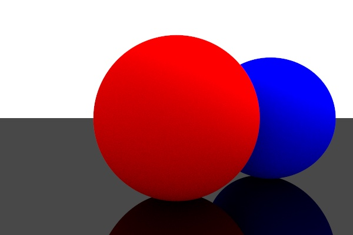

# Basics

In its most basic form, ray tracing works by:
  - casting rays from a camera, 
  - determining where they intersect the scene, 
  - and coloring the pixels accordingly.


## Intersection

A ray is a half-line. Rays are represented in parametric form: `p = s + t*d`, where:
  - `p` is a point on the ray, 
  - `s` is the position where the ray starts,
  - `d` its direction (unit vector by convention),
  - `t` the free parameter. Different `t`s (`t > 0`) yield different points along the ray.

### Sphere
In order to intersect a ray with, e.g., a sphere, we simply find a `t` so that the corresponding point `p` lies on both the ray and the sphere:
```
(p-center)² = r²      (sphere)
p = s + t*d           (ray)
```
yielding:
```
t = (v.d)±sqrt((v.d)²-(v²-r²))   with v = s-center
```

If we now color pixels where the ray intersects the sphere (valid `t`) white and the others black, we might get an image like:


### Sheet
Similarly for an infinite, horizontal sheet at height `y0` (e.g. a floor plane):

```
y = y0         (sheet)
y = ys + t*yd  (ray)

=> t = (y0-ys)/yd
```

We must be careful to:
  - pick a positive `t` (we don't want to see objects *behind* the camera).
  - pick the smallest `t` if there are multiple candidates (we can only see the closest intersection point, the one on the back is hidden).

Adding a sheet and another sphere to the scene, we can now see occlusion. E.g.: part of the blue sphere is hidden because the red sphere has points with a smaller `t` in front of it.


## Lighting

A point source with power `P` (measured in Watts), creates light with intensity `I` (measured in W/m²) at a distance `r` according to:

```
I = P / (4*pi*r²)
```

If light strikes a surface at an angle `θ` with respect to the surface normal `n`, this intensity is reduced by a factor `cos(θ)` (and clamped to 0 when `cos(θ)<0`, i.e. lit from behind).


### Shadows

If the line of sight between the light source and a surface intersects an other object, the intensity received is zero, i.e., a shadow:


### Smooth light sources

The shadows cast by point sources are rather harsh. We can make them more natural by using a spatially extended light source. This can be done by randomly jittering the point source each time we illuminate a pixel. E.g. we can randomly jitter from a gaussian distribution or pick points from within a sphere, etc.

Such an image is noisy:


But when we average out many such images (Monte Carlo Integration), we obtain a beautiful result:


### Anti-aliasing

Now that we are doing Monte Carlo integration, we can easily anti-alias sharp edges: simply jitter the position of each ray randomly within the pixel it starts from.


### Bi-directional path tracing

Monte Carlo integration opens the way physically accurate light transport.
When a ray hits a diffuse surface, we now don't only add the light contributed by the sources, but also light reflected by all other objects in the scene. Monte Carlo integration makes this easy: just cast a single random ray from the surface and add the intensity of whatever this ray strikes (without light fall-off). Off course the recursion depth has to be limited lest our secondary ray bounces around for ever. Repeat many times and average out.

E.g.: we now see the spheres are also indirectly illuminated from below, by the light reflected from the ground.


### Ambient occlusion

Let's place the spheres in a white room. The room now indirectly illuminates the spheres from all directions, making them look very soft. The relatively strong shadows directly underneath the spheres are referred to as "ambient occlusion". This effect emerges naturally with bi-directional path tracing when the recursion depth is sufficient (here: 6).


### Reflection

Reflection is easy. When a ray hits a reflective surface, the returned color is simply the color seen by the reflected ray, multiplied by a reflectivity factor (e.g. 90% for shiny metal). The direction of the reflected ray is described here: https://en.wikipedia.org/wiki/Ray_tracing_(graphics)#Example.


